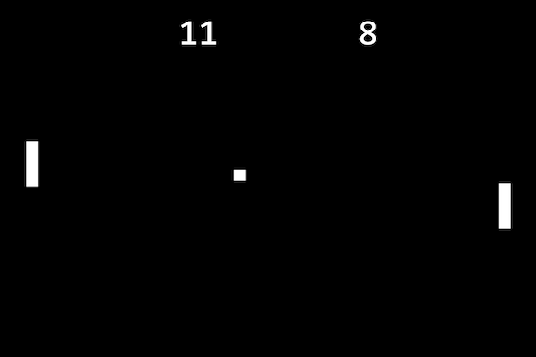

# Pong FX

**Classical Pong game implemented in JavaFX.**

## Requirements

* Java 9 JRE or above with JavaFX lib
* Gradle 4

Remarks:

* Some JDK's provided by sdkman do not contain the JavaFX libs (openjdk and zulu). Use Oracle instead.
* This application might also run with Java 8 (untested)

## Run

`$ gradle runApp`

## License

[GNU General Public License version 3.0](https://www.gnu.org/licenses/gpl-3.0.en.html)
 